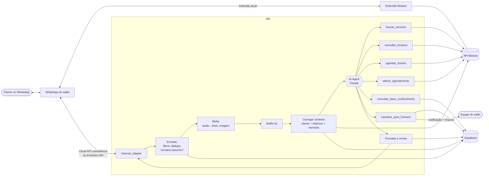
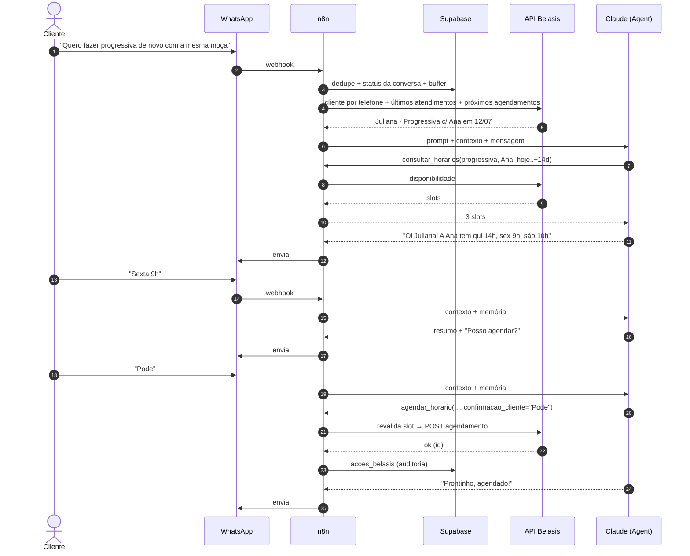
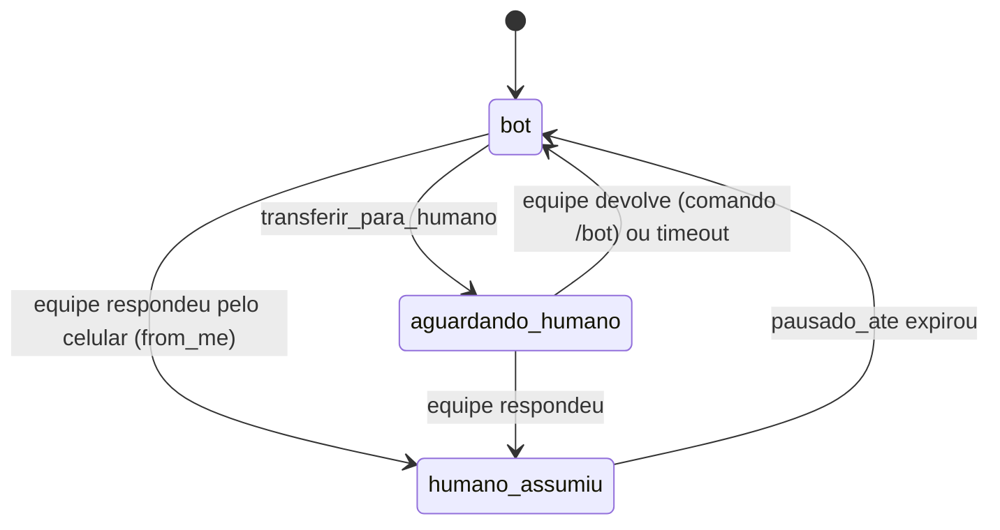
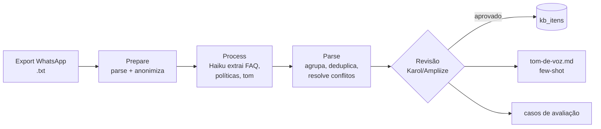

# Arquitetura

## 1. Visão geral

Princípios aplicados:

- **Um agente só, poucas ferramentas** (skills *project-development* / *tool-design*): o problema é um diálogo com 6 ações bem definidas — não há ganho em multi-agente, só latência e custo.
- **Determinístico em volta, LLM no meio**: filtros, buffer, contexto, guardas de escrita e envio são código; o LLM só conversa e escolhe ferramentas.
- **Belasis é a fonte da verdade** para dados vivos (agenda, preços, histórico). Supabase guarda estado da conversa, KB e logs — nunca uma cópia da agenda.
- **Canal isolado num adaptador**: trocar Cloud API ↔ Evolution API não mexe no agente.

## 2. Sequência — "quero progressiva com a mesma profissional"

## 3. Estados da conversa

## 4. Workflows n8n

| Workflow | Tipo | Responsabilidade |
|---|---|---|
| `WA · Entrada` | Webhook (shell) | Recebe do canal, normaliza, dedupe, detecta `from_me`, checa status, mídia, buffer; chama `Agente · Core` |
| `WA · Enviar mensagem` | Sub-workflow | Único ponto de envio: quebra em blocos, delay de digitação, loga |
| `Agente · Core` | Sub-workflow | Carrega contexto, AI Agent + memória + ferramentas, retorna resposta |
| `Tool · buscar_servicos` | Sub-workflow (tool) | Serviços/preços/profissionais (cache 1 h) |
| `Tool · consultar_horarios` | Sub-workflow (tool) | Disponibilidade Belasis |
| `Tool · agendar_horario` | Sub-workflow (tool) | Revalida + cria + audita + idempotência |
| `Tool · alterar_agendamento` | Sub-workflow (tool) | Remarca/cancela com checagem de dono |
| `Tool · consultar_base_conhecimento` | Sub-workflow (tool) | KB aprovada no Supabase |
| `Tool · transferir_para_humano` | Sub-workflow (tool) | Muda status, gera resumo, notifica equipe |
| `Belasis · Cliente por telefone` | Sub-workflow | Normaliza telefone, busca, cache |
| `KB · Pipeline histórico` | Manual | Acquire→prepare→process→parse→render do export do WhatsApp |
| `Ops · Erros` | Error Trigger | Alerta Ampliize em falhas |
| `Ops · Reativar bot` | Cron 15 min | Volta conversas `humano_assumiu` expiradas para `bot` |

## 5. Pipeline de conhecimento (execução única + reexecuções)

## 6. Ambientes

| Ambiente | Canal | Belasis | Uso |
|---|---|---|---|
| Homologação | Evolution API com número de teste | Credencial de homologação / unidade teste | Desenvolvimento e suíte de avaliação |
| Produção | Número do salão (Cloud API coexistência ou Evolution) | Produção | Go-live 08/10 com monitoramento |
