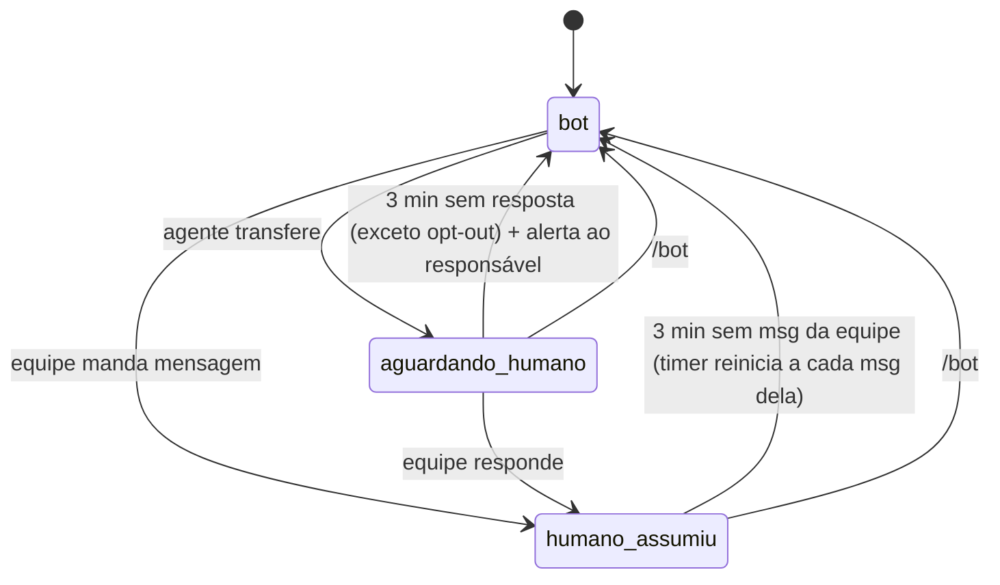

# Banco de dados (Supabase "cabelos by karol")

Migrations em [`supabase/migrations/`](../supabase/migrations) (já aplicadas no projeto). Testes: [`supabase/tests/fluxos.sql`](../supabase/tests/fluxos.sql) (entrada, lote, envio, handoff, idempotência) [`supabase/tests/retomada.sql`](../supabase/tests/retomada.sql) (devolução automática, 15 verificações) e [`supabase/tests/escalonamento.sql`](../supabase/tests/escalonamento.sql) (3 min, encaminhamento ao responsável e dashboard, 12 verificações). Ambos usam dados fictícios e não deixam nada gravado.

## Acesso

- **Só o n8n acessa**, com a credencial Postgres (ou `service_role`). RLS ligado em todas as tabelas, sem policies, e sem privilégio para `anon`/`authenticated`: a chave pública não lê nada.
- A lógica sensível (dedupe, pausa, anti-ban, idempotência) fica em **funções no banco**, para o n8n ficar simples e as regras ficarem num lugar só.

## Tabelas

| Tabela | Para quê |
|---|---|
| `config_bot` | Parâmetros e kill switch (ver abaixo) |
| `equipe` | Números da equipe (ignorados pelo bot) e quem recebe transferências |
| `conversas` | 1 por telefone: status (`bot` / `humano_assumiu` / `aguardando_humano`), pausa, opt-out, id da cliente no Belasis |
| `mensagens` | Todas as mensagens de entrada e saída; `processada_em` nulo = no buffer de agrupamento |
| `n8n_chat_histories` | Memória do AI Agent (nó *Postgres Chat Memory*, `session_id = conversas.id`) |
| `execucoes_agente` | Tokens, latência, tool calls e erros de cada resposta |
| `acoes_belasis` | Auditoria + idempotência de toda escrita no Belasis, com o "sim" literal da cliente |
| `handoffs` | Transferências para humano |
| `kb_itens` | Base de conhecimento (só `aprovado = true` vai para o bot); busca em português sem acento |
| `cache_belasis` | Cache das respostas do Belasis |
| `rate_limit` | Contador por minuto (Belasis 25/min, envio WhatsApp 20/min) |
| `notificacoes_equipe` | Fila de encaminhamentos ao responsável (tipo, mensagem da cliente, resumo, destinatários, se foi entregue) |
| `painel_usuarios` | E-mails com acesso ao dashboard |
| `retomadas_bot` | Log de cada vez que a conversa voltou para o agente (origem, quantas mensagens estavam esperando, id da chamada ao n8n) |

Views: `vw_metricas_diarias`, `vw_handoffs_abertos`, `vw_alertas_escrita_sem_confirmacao` (deve ficar sempre vazia).

Rotinas pg_cron:
- `cbk-devolver-conversas` (a cada minuto): devolve ao agente as conversas cujo timer venceu (ver "Devolução automática").
- `cbk-limpeza-diaria` (03:17 BRT): apaga mensagens/logs com mais de `retencao_mensagens_dias`, cache vencido e contadores antigos.

## Devolução automática ao agente (por inatividade da equipe)



1. Cada mensagem da equipe na conversa (pelo celular ou WhatsApp Web) coloca o bot em pausa e **reinicia** o timer de `devolver_ao_bot_apos_minutos` (padrão **3 min**).
2. Se a cliente escreve enquanto a equipe está na conversa, o bot continua quieto, mas a equipe ganha **no mínimo** `minutos_tolerancia_resposta_humana` (padrão **3 min**) para responder aquela mensagem.
3. O job `cbk-devolver-conversas` roda a cada minuto. Timer vencido → conversa volta para `bot`, as mensagens da cliente **que ficaram sem resposta** desde a última fala da equipe/bot são reabertas, e o n8n é acionado pelo webhook **`WA · Retomada`** para o agente responder na hora.
4. Se a cliente escrever antes do job rodar, a devolução acontece na própria entrada (`origem = "retomada"`), já juntando as pendentes no lote.
5. Depois de uma transferência (`iniciar_handoff`), o agente volta sozinho após `minutos_espera_handoff` (padrão **3 min**) **sem nenhuma resposta da equipe**, exceto nos motivos de `motivos_sem_retorno_automatico` (padrão: só opt-out; reclamação volta em 3 min e o responsável é alertado), que só voltam com `/bot`.
6. Pendentes com mais de `retomada_max_horas_msg_pendente` (12 h) não são respondidas; fora da janela de 24 h, no piloto fora da whitelist ou com o bot desligado, a conversa volta ao bot mas ninguém é acionado.

**Contexto para o agente na retomada:** `contexto_conversa(conversa_id, 20)` devolve as últimas mensagens **incluindo o que a equipe falou** (a memória do n8n só tem as falas do próprio bot). O `Agente · Core` deve usar isso no prompt quando `origem` for `retomada`, `humano_inativo` ou `handoff_sem_resposta`, para continuar de onde a equipe parou, sem se reapresentar e sem contradizer o que foi combinado.

### Webhook `WA · Retomada` (n8n)

O banco chama via `pg_net`:

```http
POST {n8n_webhook_retomada_url}
x-cbk-secret: <segredo do Vault>
Content-Type: application/json

{"evento":"retomada","origem":"humano_inativo","conversa_id":"…","mensagem_id":123,
 "telefone":"5511…","nome":"Ju","belasis_cliente_id":45,"pendentes":1}
```

No n8n: validar o header `x-cbk-secret` → `coletar_lote(conversa_id, mensagem_id)` → mesmo caminho do `Agente · Core` (sem a espera do buffer).

Para ligar (quando o n8n estiver no ar):

```sql
update config_bot set valor = '"https://SEU-N8N/webhook/wa-retomada"' where chave = 'n8n_webhook_retomada_url';
select vault.create_secret('<segredo-forte>', 'n8n_webhook_retomada_secret');
```

Sem isso configurado, tudo funciona igual, só que a resposta às pendentes sai na próxima mensagem da cliente, não na hora.

## Funções que o n8n chama

| Onde (workflow) | Função | Retorno |
|---|---|---|
| `WA · Retomada` (chamado pelo banco) | `coletar_lote(conversa_id, mensagem_id)` → agente | ver "Devolução automática" |
| `Agente · Core`, montar o prompt | `contexto_conversa(conversa_id, 20)` | últimas mensagens com autor (cliente/bot/humano) |
| `WA · Entrada`, para todo webhook | `registrar_mensagem_entrada(message_id, telefone, from_me, tipo, texto, media_url, push_name, jid, raw)` | `acao`: `processar` / `humano` / `ignorar` + `motivo`, `conversa_id`, `mensagem_id`, `janela_segundos` |
| `WA · Entrada`, após esperar a janela | `coletar_lote(conversa_id, mensagem_id)` | `processar=true` com `texto` juntado e `imagens`, ou `processar=false` (outra execução cuida) |
| `WA · Enviar`, antes de cada bloco | `verificar_envio(conversa_id)` | `permitido` + `aguardar_ms` (intervalo por conversa) ou `motivo` do bloqueio |
| `WA · Enviar`, após enviar | `registrar_mensagem_saida(conversa_id, texto, message_id)` | id |
| `Belasis · Request`, antes de cada chamada | `reservar_chamada_belasis()` | `permitido` / `aguardar_ms` |
| `Belasis · Request`, ao receber 429 | `bloquear_cota('belasis')` | — |
| `Belasis · Request` | `cache_get(chave)` / `cache_set(chave, valor, ttl_segundos)` | jsonb / — |
| `Tool · agendar_horario` / `alterar_agendamento` | `reservar_acao_belasis(chave, conversa_id, acao, request, confirmacao)` → chamar API → `concluir_acao_belasis(...)` | `executar=false` se já foi feito (não duplica) |
| `Tool · transferir_para_humano` | `iniciar_handoff(conversa_id, motivo, resumo)` | `destinatarios` para notificar |
| `Tool · consultar_base_conhecimento` | `buscar_kb(consulta, categoria, limite)` | itens aprovados ordenados por relevância |

### Regras que o banco aplica sozinho

- **Dedupe**: mesmo `message_id` duas vezes → `ignorar/duplicada`.
- **Eco do bot**: mensagem `from_me` igual a uma que o bot enviou há menos de 2 min → ignorada.
- **Humano assumiu**: qualquer outra mensagem `from_me` pausa o bot e reinicia o timer de `devolver_ao_bot_apos_minutos` (ver "Devolução automática"). Exceção: textos que casam com `padroes_mensagens_automaticas` (lembretes da extensão Belasis) → autor `sistema`, sem pausa.
- **`/bot`** enviado pela equipe devolve a conversa na hora (opcional — o normal é deixar o timer fazer isso; se usar, apague a mensagem "para todos").
- **Kill switch**, **modo piloto** (whitelist), **opt-out** e **janela de 24 h** para envio.
- Mensagens que o bot não vai tratar saem do buffer na hora e não entram num lote futuro.
- **Telefone**: tudo normalizado para `55 + DDD + número` (acrescenta o 9º dígito que falta); número estrangeiro é ignorado.

## Configuração (`config_bot`)

| Chave | Padrão | Ação necessária |
|---|---|---|
| `bot_ativo` | `true` | Kill switch |
| `modo_piloto` | `true` | **Mudar para `false` no go-live (08/10)** |
| `whitelist_piloto` | `[]` | Colocar os números da equipe e das clientes do piloto |
| `devolver_ao_bot_apos_minutos` | `3` | Minutos sem a equipe falar para o agente voltar |
| `minutos_tolerancia_resposta_humana` | `3` | Tempo mínimo da equipe para responder uma nova msg da cliente |
| `minutos_espera_handoff` | `3` | Após transferência sem nenhuma resposta da equipe → agente volta e o responsável recebe alerta |
| `motivos_sem_retorno_automatico` | `["opt_out"]` | Só "não quero falar com robô" não volta sozinho (só com `/bot`) |
| `n8n_webhook_notificacao_url` | `null` | **Preencher**: webhook `Equipe · Notificar` do n8n |
| `notificacao_max_tentativas` | `3` | Reenvio de encaminhamento que falhou |
| `retomada_max_horas_msg_pendente` | `12` | |
| `n8n_webhook_retomada_url` | `null` | **Preencher quando o n8n estiver no ar** (+ segredo no Vault) |
| `janela_agrupamento_segundos` | `8` | |
| `envio_intervalo_min_ms` / `envio_limite_por_minuto` | `3000` / `20` | Regras anti-ban |
| `belasis_limite_por_minuto` | `25` | Limite oficial é 30 |
| `dias_busca_horarios` / `max_opcoes_horario` | `14` / `3` | |
| `status_agendamento_bot` | `"confirmed"` | Karol decide |
| `padroes_mensagens_automaticas` | `[]` | **Preencher com o início dos lembretes que a extensão Belasis envia** |
| `horario_funcionamento` | tudo `null` | **Preencher** |
| `retencao_mensagens_dias` | `180` | |

Exemplos:

```sql
update config_bot set valor = '["5511999990001","5511999990002"]' where chave = 'whitelist_piloto';
update config_bot set valor = '{"ter":["09:00","19:00"],"qua":["09:00","19:00"],"qui":["09:00","19:00"],"sex":["09:00","19:00"],"sab":["08:00","17:00"],"seg":null,"dom":null}' where chave = 'horario_funcionamento';
insert into equipe (nome, telefone, papel, recebe_handoff) values ('Karol', '5511999990001', 'dona', true);
update config_bot set valor = 'false' where chave = 'bot_ativo';   -- desliga tudo na hora
```

## Encaminhamento ao responsável

Quando o agente **não sabe o que fazer**, quando **algo dá errado** no atendimento ou quando há **erro de sistema**, a mensagem da cliente vai para o WhatsApp do responsável.

| Situação | Quem dispara | Tipo |
|---|---|---|
| Agente transfere (cliente pediu, reclamação, orçamento por foto, fora do escopo) | tool `transferir_para_humano` → `iniciar_handoff` | `transferencia` |
| Agente não tem a resposta | `transferir_para_humano(motivo="incerteza")` | `duvida_agente` |
| Problema no atendimento sem transferir (ex.: agendamento falhou, cliente confusa) | `encaminhar_para_responsavel('problema_atendimento', …)` | `problema_atendimento` |
| Erro de sistema (Belasis fora, LLM falhou, WhatsApp caiu) | Error Workflow do n8n → `encaminhar_para_responsavel('erro_sistema', …)` | `erro_sistema` |
| Ninguém respondeu a transferência em 3 min | automático (cron) | `sem_resposta_humana` |

- Destinatários: `equipe` com `recebe_handoff = true`; erros de sistema também vão para quem tem `recebe_alertas_sistema = true` (ex.: Ampliize).
- A mensagem leva: tipo, motivo, resumo do agente, as últimas mensagens da cliente, nome e telefone.
- Entrega: o banco chama o webhook `Equipe · Notificar` (pg_net); o n8n envia no WhatsApp e confirma com `marcar_notificacao(id, true|false, erro)`. Falhou → reenvio automático até 3 vezes. Tudo aparece no dashboard.

```sql
insert into equipe (nome, telefone, papel, recebe_handoff) values ('Karol', '55119…', 'dona', true);
insert into equipe (nome, telefone, papel, recebe_alertas_sistema) values ('Ampliize', '55119…', 'ampliize', true);
update config_bot set valor = '"https://SEU-N8N/webhook/equipe-notificar"' where chave = 'n8n_webhook_notificacao_url';
```

## Dashboard

Página em [`dashboard/`](../dashboard) que chama `dashboard_dados(dias)` (Hoje / 7 / 30 dias). Acesso só para e-mails em `painel_usuarios`, com login por código no e-mail. Demonstração com dados fictícios: `dashboard/index.html?demo=1`. Instruções em [`dashboard/README.md`](../dashboard/README.md).
